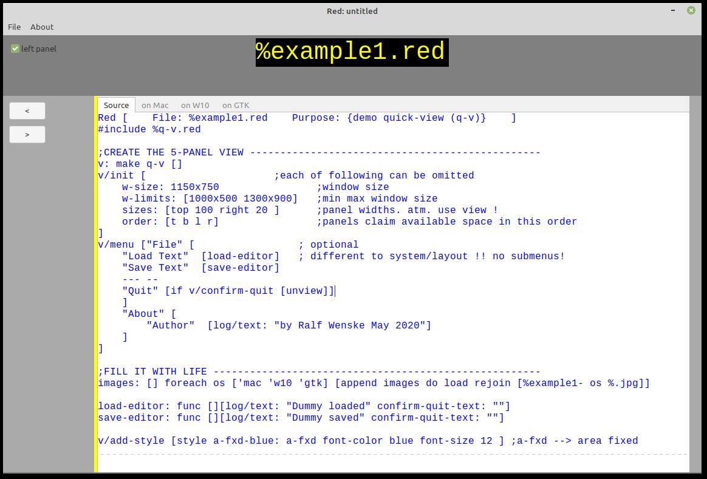

# quick-view
 
Experimental: changes are likely

Purpose:
To avoid having to fiddle with pixels q-v allows to create a resizable GUI with 5 panels.
Visual presentation of data is sometimes more appealing than endless console listings :)
```
Red []
#include %q-v.red
v: q-v/duplicate
view/flags v/window 'resize
```

- - - -

Outer panel's width can be set with /widths [t r b l]
```
Red []
#include %q-v.red
v: q-v/duplicate/widths [50 50 30 80]
v/window/size: 400x200
view/flags v/window 'resize
```
 
- - - -

Determine panels width: the order determines their extent:
```
Red []
#include %q-v.red
v: q-v/duplicate/order [l r t b]
v/window/text: "Quick View Demo"    ;title
view/flags v/window 'resize
```
 
- - - -

%example1.red shows how to place VID code into the panels
`top right bottom left` and `center` refer to each
Here the Linux (GTK) version:
 


NOTE:
    
    There are some unexpected things that remind us of the Alpha-status of Red.
    
    %example1.red can be pasted into a console and runs on Windows and Linux.

    However on my macs this doesn't work: saving the copied code into a file works though.

    Then again on Mac the loading of the images seems not to work - Windows and Linux are fine.

    The `area` face when resizing behaves differently on each platform.

    The `text` face on Windows misbehaves.

    Size does not seem to work for Windows.