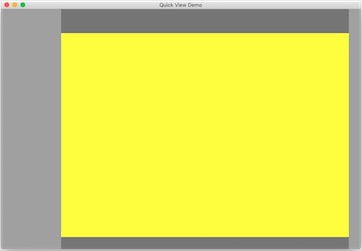
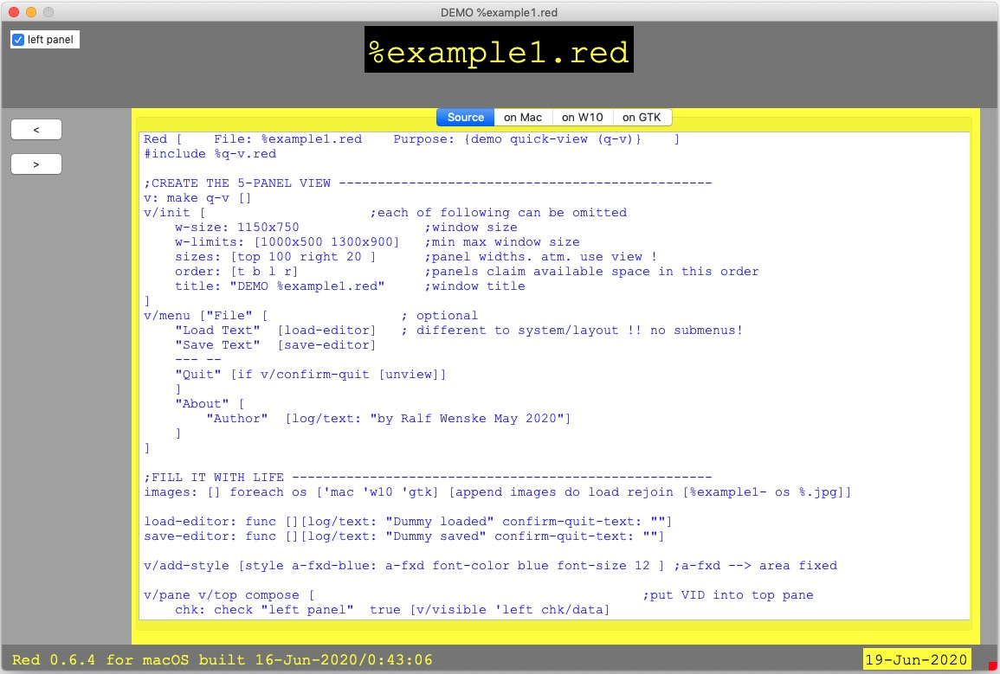

# quick-view
 
Experimental: changes are likely.

I also would appreciate suggestions to improve and make the code more 'Red' like.
My aim (besides having fun exploring Red) is to be able to quickly have a visual
interface where I can show results of my data processing - without getting lost
in presentation logic and pixel counting...
... and perhaps achieve the same for others - beginners and experts - who so 
generously share their tools and coding insights.

Purpose:

    q-v allows to create a GUI with 5 panels.
    A fully working graphical user interface with a few lines of
    (hopefully self explaining) code:
    Resizable (the window or outer panels)
    Panels can be hidden.
    Dialog preventing data loss if accidental quitting
    Easy identifying of panels: top right bottom left center

```
Red []
#include %q-v.red
v: make q-v []
v/init []
view/flags v/window 'resize
```

- - - -

Outer panel's width can be set with /widths [t r b l]
```
Red []
#include %q-v.red
v: make q-v []
v/init [
    w-size: 400x200
    sizes: [top 50 right 50 bottom 30 left 80]
]
view/flags v/window 'resize
```
 
- - - -

Determine panels width: the order determines their extent:
```
Red []
#include %q-v.red
v: make q-v []
v/init [
    order [l r t b]
    title "Quick View Demo"
]
view/flags v/window 'resize
```
 
- - - -

%example1.red shows how to place VID code into the panels 
and show how user interaction can be coded. 
- hit a key in the area (dialog is triggered when closing)
- resize left panel
- hide and show left panel
- resize the window

- on GTK comment the menu to be able to resize (there is an issue see below)

Here the MacOS version:
 


NOTE:
    
    There are some unexpected things that remind us of the Alpha-status of Red.

    The `area` face when resizing behaves differently on each platform.

    The `text` face on Windows without bg-color is not transparent.
    The `check` face on MacOS without bg-color is not transparent.

    On GTK when a menu is shown the height of the viewable size is not reduced by menu-height.
    When the menu is omitted resizing works partly. Exceeding the limits causes strange behaviour of the dragger. (Working fine on macOS and W10)
    Use `view/flags v/window 'resize` instead.